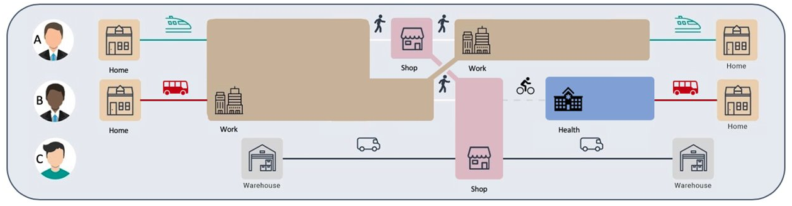
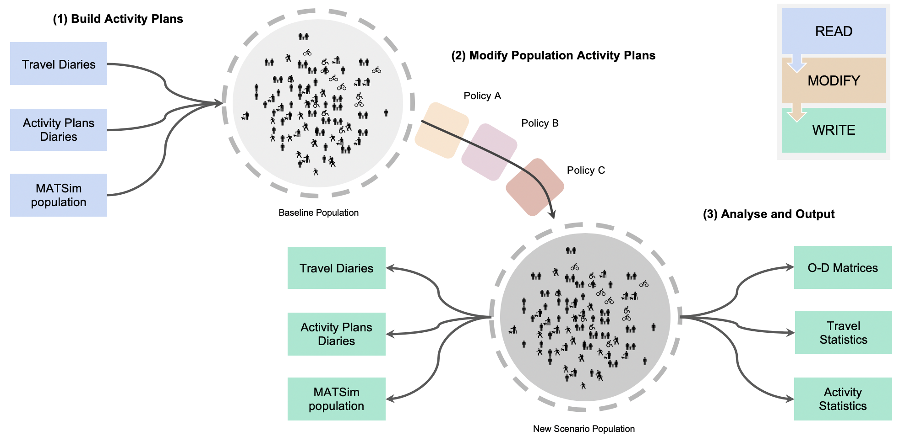

<!--- the "--8<--" html comments define what part of the README to add to the index page of the documentation -->
<!--- --8<-- [start:docs] -->


# Population Activity Modeller


[](https://arup-group.github.io/pam)
[](https://medium.com/arupcitymodelling/pandemic-activity-modifier-intro-3d2dccbc716e)

PAM is a python library for population **activity sequence** modelling. Example use cases:

- **Read** an existing population then **write** to a new format.
- **Modify** an existing population, for example to model activity locations.
- **Create** your own activity-based model.

PAM supports common travel and activity formats, including MATSim.

## Activity Sequences?

Population **activity sequences** (sometimes called **activity plans**) are used to model the activities (where and when people are at home, work, education and so on) and associated travel of a population:

 

Activity sequences are used by transport planners to model travel demand, but can also be used in other domains, such as for virus transmission or energy use modelling.

## Brief History

PAM was originally built and shared to rapidly modify existing activity models to respond to pandemic lock-down scenarios.

 

This functionality used a **read-modify-write** pattern. Where modifications are made by applying **policies**. Example policies might be (a) infected persons quarantine at home, (b) only critical workers travel to work, and (c) everyone shops locally.



## Features

### Activity Modelling

In addition to the original **read-modify-write** pattern and functionality, PAM has modules for:

- location modelling
- discretionary activity modelling
- mode choice modelling
- facility sampling
- vehicle ownership

More generally the core PAM data structure and modules can be used as a library to support your own use cases, including building your own activity-based model.

### MATSim

PAM fully supports the [MATSim](https://www.matsim.org/) population/plans format. This includes vehicles, unselected plans, leg routes and leg attributes. A core use case of PAM is to ***read-modify-write*** *experienced plans* from MATSim. This can allow new MATSim scenarios to be *"warm started"* from existing scenarios, significantly reducing MATSim compute time.

<!--- --8<-- [end:docs] -->
## Documentation

For more detailed instructions, see our [documentation](https://arup-group.github.io/pam/latest).

## Installation

To install PAM, we recommend using the [mamba](https://mamba.readthedocs.io/en/latest/index.html) package manager:

### As a user
<!--- --8<-- [start:docs-install-user] -->
``` shell
mamba create -n pam -c conda-forge -c city-modelling-lab cml-pam
mamba activate pam
```
<!--- --8<-- [end:docs-install-user] -->
### As a developer
<!--- --8<-- [start:docs-install-dev] -->
``` shell
git clone git@github.com:arup-group/pam.git
cd pam
mamba create -n pam -c conda-forge -c city-modelling-lab --file requirements/base.txt --file requirements/dev.txt
mamba activate pam
pip install --no-deps -e .
```
<!--- --8<-- [end:docs-install-dev] -->

### Installing with pip

Installing directly with pip as a user (`pip install cml-pam`) or as a developer (`pip install -e '.[dev]'`) is also possible, but you will need the `libgdal` & `libspatialindex` geospatial non-python libraries pre-installed.

For more detailed instructions, see our [documentation](https://arup-group.github.io/pam/latest/installation/).

## Contributing

There are many ways to make both technical and non-technical contributions to PAM.
Before making contributions to the PAM source code, see our contribution guidelines and follow the [development install instructions](#as-a-developer).

If you are using `pip` to install PAM instead of the recommended `mamba`, you can install the optional test and documentation libraries using the `dev` option, i.e., `pip install -e '.[dev]'`

If you plan to make changes to the code then please make regular use of the following tools to verify the codebase while you work:

- `pre-commit`: run `pre-commit install` in your command line to load inbuilt checks that will run every time you commit your changes.
The checks are: 1. check no large files have been staged, 2. lint python files for major errors, 3. format python files to conform with the [pep8 standard](https://peps.python.org/pep-0008/).
You can also run these checks yourself at any time to ensure staged changes are clean by simple calling `pre-commit`.
- `pytest` - run the unit test suite, check test coverage, and test that the example notebooks successfully run.
- `pytest -p memray -m "high_mem" --no-cov` (not available on Windows) - after installing memray (`mamba install memray pytest-memray`), test that memory and time performance does not exceed benchmarks.

For more information, see our [documentation](https://arup-group.github.io/pam/latest/contributing/coding/).

## Building the documentation

If you are unable to access the online documentation, you can build the documentation locally.
First, [install a development environment of PAM](https://arup-group.github.io/pam/latest/contributing/coding/), then deploy the documentation using [mike](https://github.com/jimporter/mike):

```
mike deploy 0.2
mike serve
```

Then you can view the documentation in a browser at <http://localhost:8000/>.

## Credits

This package was created with [Cookiecutter](https://github.com/audreyr/cookiecutter) and the [arup-group/cookiecutter-pypackage](https://github.com/arup-group/cookiecutter-pypackage) project template.
