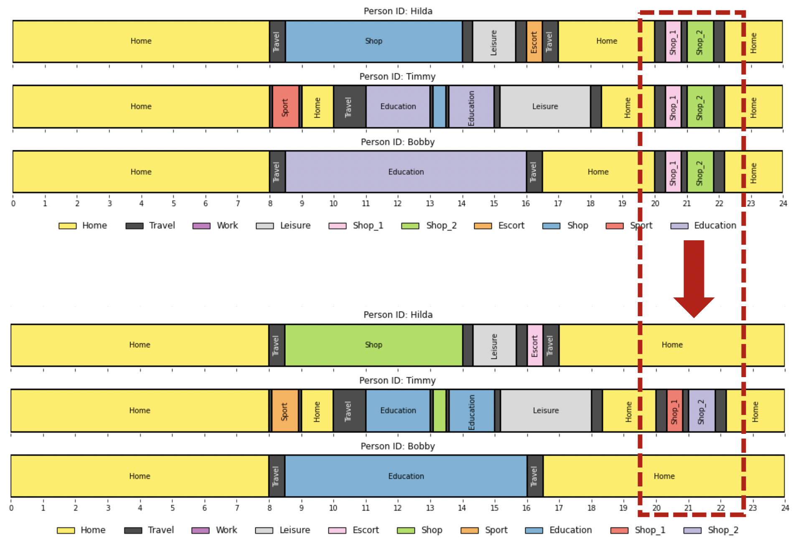

# Population Activity Modeller (PAM)


PAM is a python API for activity sequence modelling. Primary features:

- common format read/write inccluding MATSim xml
- sequence inference from travel diary data
- rules based sequence modification
- sequence visualisation
- facility sampling
- research extensions

PAM was originally called the "Pandemic Activity Modifier". It was built in response to COVID-19, to better and more quickly update models for behaviour changes from lockdown policies than existing aggregate models.

 

**Who is this for?** PAM is intended for use by any modeller or planner using trip diary data or activity plans.
**What can this do?** PAM provides an API and examples for modifying activity plans, for example, based on COVID-19 lockdown scenarios.

You can read about PAM on medium [here](https://medium.com/arupcitymodelling/pandemic-activity-modifier-intro-3d2dccbc716e).

## Features

This project is not a new activity model. Instead it to seeks to adjust existing activity
representations, already derived from exiting models or survey data:


(i) **Read/Load** input data (eg travel diary) to household and person Activity Plans.

(ii) **Modify** the Activity Plans for new social and government policy scenarios (eg
remove education activities for non key worker households). Crucially PAM facilitates
application of detailed policies at the person and household level, while still respecting
the logic of arbitrarily complex activity chains.

(iii) **Output** to useful formats for activity based models or regular transport models. Facilitate preliminary **Analysis** and **Validation** of changes.

This work is primarily intended for transport modellers, to make quick transport demand
scenarios. But it may also be useful for other activity based demand modelling such as for goods
supply or utility demand.

## Contents

- [Installation](#installation)
- [Why Activity Plans?](#why-activity-plans)
- [Modelling the pandemic](#modelling-the-pandemic)
- [Example modifiers/policies](#example-modifierspolicies)
- [Populations](#populations)
- [Read methods](#read-methods)
- [Read/Write/Other formats](#readwriteother-formats)
- [Activity Plans](#activity-plans)
- [Get involved](#get-involved)
- [Technical notes](#technical-notes)

## Installation

Assuming python ~3.7 and using git:

```
git clone git@github.com:arup-group/pam.git
cd pam
python3 -m venv venv #intall into virtual environment
source venv/bin/activate
pip install -e .
```

### Underlying native dependencies

PAM uses some Python libraries that rely on underlying native geospatial libraries. If you are missing these libraries,
`pip install` will fail, most likely with errors about `GDAL`
(e.g. `Failed to get options via gdal-config: [Errno 2] No such file or directory: 'gdal-config': 'gdal-config'`) or
`PROJ`. Installation of these dependencies varies according to your operating system, for example:

| OS       | Commands |
|----------|----------|
|Mac OS    | `brew install spatialindex` <br/> `brew install gdal --HEAD` <br/> `brew install gdal` 
|Ubuntu    | `sudo apt install libspatialindex-dev` <br/> `sudo apt install libgdal-dev`|

If you are using Anaconda to manage your environment, it will discover and install these native dependencies for you, as
described [below](#windows-installation).


### Windows installation
We strongly recommend using a virtual environment.

If installation fails, we recommend to try the following code **using the Anaconda Powershell Prompt**:

```
# Clone the folders into the CD
git clone git@github.com:arup-group/pam.git

# Create a conda environment
conda create -n venv python=3.7

# Check your Python version running python in your terminal
conda activate venv
conda install geopandas
# change directory to pam
cd pam
# install the current directory (your project) in editable mode (-e .)
pip install -e .
```

### Developing PAM
If you plan to make changes to the code then please make regular use of the following tools to verify the codebase
while you work:

- `scripts/code-qa/qa-checks.sh` - run a sensible combination of all the following
- `pytest` - run the unit test suite
- `scripts/code-qa/code-coverage.sh` - run unit tests and verify the code coverage threshold
- `scripts/code-qa/notebooks-smoke-test.sh` - smoke test all Jupyter notebooks found in the `examples` directory
- `scripts/code-qa/check-staged-file-sizes.sh` - check for large file sizes that have been git staged
- `scripts/code-qa/check-all-file-sizes.sh` - check for large file sizes

#### Git Commit Hook
You can automate the above checks using our [git commit hook](https://git-scm.com/book/en/v2/Customizing-Git-Git-Hooks)
so that they will all run when you `git commit`; the commit will be rejected if any of the checks fail.
To implement this automation simply copy `scripts/git-hooks/pre-commit` to `.git/hooks/pre-commit`. eg for MacOS/Linux:

```sh
cp scripts/git-hooks/pre-commit .git/hooks/
```

If for some reason you want to bypass the commit hook for a given commit, you can do so via
`git commit --no-verify`. Best not to make a habit of that though :-).

## Why Activity Plans?

 

1. They are the ideal mechanism for applying changes, allowing for example,
consideration of joint dis-aggregate features across an entire day.

2. They can be post processed for many other output formats such as origin-destination matrices or activity diaries. These outputs can the be used in many different
applications such as transport, utility demand, social impact and so on.

## Modelling the pandemic

PAM uses **policies** to model change to a population. For example, based on social distancing requirements we might
want to reflect that people are expected to make less shared shopping trips or tours. We can do this using the
following policy:
```
policy_reduce_shopping_activities = HouseholdPolicy(
        ReduceSharedActivity(['shop', 'shop_food']),
        ActivityProbability(['shop', 'shop_food'], 1)
)
```
if you want to define the policy from first principles. There exists a convenience class for this policy and
an equivalent policy can be defined in the following way:
```
policy_reduce_shopping_activities = ReduceSharedHouseholdActivities(
        ['shop', 'shop_food'],
        ActivityProbability(['shop', 'shop_food'], 1)
)
```
This policy removes all but one the household's shared shopping tours:



In general, a policy is defined in the following way:

- You first select the level at which is should be applied:
    - `HouseholdPolicy`
    - `PersonPolicy`
    - `ActivityPolicy`
- You then select the modifier, which performs the actions to a person's activities
    - `RemoveActivity`
    - `ReduceSharedActivity`
    - `MoveActivityTourToHomeLocation`
- Finally, you give a likelihood value with which the policy should be applied with. You have a few choices here:
    - a number greater than 0 and less or equal to 1. This will be understood to be at the level at which the policy
    is applied.
        - E.g. `PersonPolicy(RemoveActivity(['work']), 0.5)` will give each person a fifty-fifty chance of having
    their work activities removed.
    - you can explicitly define at which level a number greater than 0 and less or equal to 1 will be applied by passing:
        - E.g. `HouseholdPolicy(RemoveActivity(['work']), PersonProbability(0.5))` will apply a probability of 0.5
        per person in a household, and apply the policy to all persons within a household if selected.
    - you can also pass a function that operates on a `core.Household`, `core.Person` or `core.Activity` object and
    returns a number between 0 and 1.
        - E.g. if
        ```
        def sampler(person):
            if person.attributes['key_worker'] == True:
                return 0
            else:
                return 1
        ```
        we can define `PersonPolicy(RemoveActivity(['work']), PersonProbability(sampler))` which will remove all work
        activities from anyone who is not a 'key_worker'
    - you can choose from:
        - `HouseholdProbability`
        - `PersonProbability`
        - `ActivityProbability`

PAM allows multiple of such policies to be combined to build realistic and complex scenarios. Leveraging activity plans means that PAM can implement detailed policies that are dependant on:

- person attributes
- household attributes
- activity types
- travel modes
- times
- spatial locations
- sequences such as tours
- any combination of the above

A full overview of policies and examples of the policies available are [detailed in this notebook](https://github.com/arup-group/pam/blob/master/notebooks/PAM%20Policies%20walk-through.ipynb).

## Example modifiers/policies:

##### Ill and self-quarantined

- Person quarantine based on age
- Household quarantine based on household members

##### Education activities

Remove or reduce education based tours/trips including escorts:

- Remove education activities based on age
- Maintain education for 'care-constrained' households (critical workers)

##### Work activities

- Furlough and unemployment based on sector
- Work from home based on sector
- Increase or reduce activities and activity durations based on sector

##### Shopping activities

- Remove or reduce discretionary shopping
- Reduce food shopping
- Remove shared tours
- Move tours closer to home

##### Discretionary activities

- Remove or reduce discretionary activities such as leisure
- Move tours closer to home

##### In progress

Logic also be added to apply:

- mode shift
- location shift
- times
- durations

## CLI

Some common functionality, for MATSim formatted populations, can be accessed via the command line. Once pam is installed, start by typing in `pam --help` to your command line:

```
Usage: pam [OPTIONS] COMMAND [ARGS]...

  Population Activity Modeller (PAM) Command Line Tool

Options:
  --help  Show this message and exit.

Commands:
  crop    Crop a population's plans outside a core area.
  report  Various reporting for MATSim formatted plans.
  sample  Down- or up-sample a PAM population.
  combine Combine multiple populations into one xml file.
```

For example:
* to get a summary or a MATSim plans file: `pam report summary tests/test_data/test_matsim_plansv12.xml`.
* plan cropping: `pam crop <path_population_xml> <path_core_area_geojson> <path_output_directory>`.
* down/up-sampling an xml population: `pam sample <path_population_xml> <path_output_directory> -s <sample_percentage> -v <matsim_version>`. For example, you can use: `pam sample tests/test_data/test_matsim_plansv12.xml tests/test_data/output/sampled -s 0.1` to create a downsampled (to 10%) version of the input (`test_matsim_plansv12.xml`) population.
* combining populations: `pam combine <input_population_1> <input_population_2> <input_population_3...etc> -o <outpath_directory> -m <comment> -v <matsim_version>`.


## Populations

We have some read methods for common input data formats - but first let's take a quick
look at the core pam data structure for populations:

```
from pam.core import Population, Household, Person

population = Population()  # initialise an empty population

household = Household('hid0', attributes = {'struct': 'A', 'dogs': 2, ...})
population.add(household)

person = Person('pid0', attributes = {'age': 33, 'height': 'tall', ...})
household.add(person)

person = Person('pid1', attributes = {'age': 35, 'cats_or_dogs?': 'dogs', ...})
household.add(person)

population.print()
```

## Read methods

The first step in any application is to load your data into the core pam format (pam.core.Population). We
are trying to support comon tabular formats ('travel diaries') using `pam.read.load_travel_diary`. A
travel diary can be composed of three tables:

- `trips` (required) -  a trip diary for all people in the population, with rows representing trips
- `persons_attributes` (optional) - optionally include persons attributes (eg: `person income`)
- `households_attributes` (optional) - optionally include households attributes (eg: `hh number of cars`)

The input tables are expected as pandas.DataFrame, eg:
```
import pandas as pd
import pam

trips_df = pd.read_csv(trips.csv)
persons_df = pd.read_csv(persons.csv)

# Fix headers and wrangle as required
# ...

population = pam.read.load_travel_diary(
    trips = trips_df,
    persons_attributes = persons_df,
    hhs_attributes = None,
    )

print(population.stats)

example_person = population.random_person
example_person.print()
example_person.plot()
```

PAM requires tabular inputs to follow a basic structure. Rows in the `trips` dataframe represent unique trips by all persons, rows in the
`persons_attributes` dataframe represent unique persons and rows in the `hhs_attributes` dataframe represent unique households. Fields
named `pid` (person ID) and `hid` (household ID) are used to provide unique identifiers to people and households.

**Trips Input:**

eg:
| pid | hid | seq | hzone | ozone | dzone | purp | mode | tst | tet | freq |
| --- | --- | --- | --- | --- | --- | --- | --- | --- | --- | --- |
| 0 | 0 | 0 | Harrow | Harrow | Camden | work | pt | 444 | 473 | 4.54 |
| 0 | 0 | 1 | Harrow | Camden | Harrow | home | pt | 890 | 919 | 4.54 |
| 1 | 0 | 0 | Harrow | Harrow | Tower Hamlets | work | car | 507 | 528 | 2.2 |
| 1 | 0 | 1 | Harrow | Tower Hamlets | Harrow | home | car | 1065 | 1086 | 2.2 |
| 2 | 1 | 0 | Islington | Islington | Hackney | shop | pt | 422 | 425 | 12.33 |
| 2 | 1 | 1 | Islington | Hackney | Hackney | leisure | walk | 485 | 500 | 12.33 |
| 2 | 1 | 2 | Islington | Croydon | Islington | home | pt | 560 | 580 | 12.33 |


A `trips` table is composed of rows representing unique trips for all persons in the population. Trips must be correctly ordered according to their sequence unless a numeric `seq` (trip sequence) field is provided, in which case trips will be ordered accordingly for each person.

The `trips` input **must** include the following fields:
- `pid` - person ID, used as a unique identifier to associate trips belonging to the same person and to join trips with person attributes if provided.
- `ozone` - trip origin zone ID
- `dzone` - trip destination zone ID
- `mode` - trip mode - note that lower case strings are enforced
- `tst` - trip start time in minutes (integer) or a datetime string (eg: "2020-01-01 14:00:00")
- `tet` - trip end time in minutes (integer) or a datetime string (eg: "2020-01-01 14:00:00")

The `trips` input must **either**:
- `purp` - trip or tour purpose, eg 'work'
- `oact` and `dact` - origin activity type and destination activity type, eg 'home' and 'work'

*Note that lower case strings are enforced and that 'home' activities should be encoded as `home`.*

The `trips` input **may** also include the following fields:
- `hid` - household ID, used as a unique identifier to associate persons belonging to the same household and to join with household attributes if provided
- `freq` - trip weighting for representative population
- `seq` - trip sequence number, if omitted pam will assume that trips are already ordered
- `hzone` - household zone

**'trip purpose' vs 'tour purpose':**

We've encountered a few different ways that trip purpose can be encoded. The preferred way being to encode a trip purpose as being the activity of the destination, so that a trip home would be encoded as `purp = home`. However we've also seen the more complex 'tour purpose' encoding, in which case a return trip from work to home is encoded as `purp = work`. Good news is that the `pam.read.load_travel_diary` will deal ok with either. But it's worth checking.

**Using persons_attributes and /or households_attributes**

eg:
```
# persons.csv
| pid | hid | hzone | freq | income| age | driver | cats or dogs |
| --- | --- | --- | --- | --- | --- | --- | --- |
| 0 | 0 | Harrow | 10.47 | high | high | yes | dogs |
| 1 | 0 | Harrow | 0.034 | low | medium | no | dogs |
| 2 | 1 | Islington | 8.9 | medium | low | yes | dogs |

# households.csv
| hid | hzone | freq | persons | cars |
| --- | --- | --- | --- | --- |
| 0 | Harrow | 10.47 | 2 | 1 |
| 1 | Islington | 0.034 | 1 | 1 |
```

If you are using persons_attributes (`persons_attributes`) this table must contain a `pid` field (person ID). If you are using persons_attributes (`households_attributes`) this table must contain a `hid` field (household ID). In both cases, the frequency field `freq` may be used. All other attributes can be included with column names to suit the attribute. Note that `hzone` (home zone) can optionally be provided in the attribute tables.

**A note about 'freq':**

Frequencies (aka 'weights') for trips, persons or households can optionally be added to the respective input tables using columns called `freq`. We generally assume a frequency to represent expected occurances in a full population. For example if we use a person frequency (`person.freq`) the the sum of all these frequencies (`population.size`), will equal the expected population size.

Because it is quite common to provide a person or household `freq` in the trips table, there are two special options (`trip_freq_as_person_freq = True` and `trip_freq_as_hh_freq = True`) that can be used to pass the `freq` field from the trips table to either the people or households table instead.

Generally PAM will assume when you want some weighted output, that it should use household frequencies. If these have not been set then PAM will assume that the household frequency is the average
frequency of persons within the household. If person frequencies are not set the PAM will assume that the person frequency is the average frequency of legs within the persons plan. If you wish to adjust frequencies of a population then you should use the `set_freq()` method, eg:

```
factor = 1.2
household.set_freq(household.freq * factor)
for pid, person in household:
    person.set_freq(person.freq * factor)
```

### Read/Write/Other formats

PAM can read/write to tabular formats and MATSim xml (`pam.read.read_matsim` and `pam.write.write_matsim`). PAM can also write to segmented OD matrices using `pam.write.write_od_matrices`.

Benchmark or summary data and cross-tabulations can be extracted with the `pam.write.write_benchmarks` method, passing as arguments the data field(s) to summarise, the dimension(s) to group by, and the aggregation function(s). For example `pam.write_benchmarks(population, dimensions = ['duration_category'], data_fields= ['freq'], aggfunc = [sum]` returns the frequency breakdown of trips' duration. The `write` module also provides a number of wrappers for frequently-used bechmarks under the `write_*****_benchmark` name.

Please get in touch if you would like additional support or feel free to add your own.

## Activity Plans

But what about activity plans?

PAM supports arbitrarily complex chains of activities connected by 'legs' (these are equivalent to 'trips'). The main rules are (i) that plans must consist of sequences of alternate `pam.activity.Activity` and `pam.activity.Leg` objects and (ii) that a plan must start and end with an `Activity`:

```
from pam.core import Person
from pam.activity import Leg, Activity
from pam

person = Person('Tony', attributes = {'age': 9, 'phylosophy': 'stoicism'})

person.add(
    Activity(
        act='home',
        area='zone A',
    )
)

person.add(
    Leg(
        mode='car',
        start_time=utils.parse_time(600),  # (minutes)
        end_time=utils.parse_time(630),
    )
)

person.add(
    Activity(
        act='work',
        area='zone B',
        )
    )

person.add(
    Leg(
        mode='car',
        start_time=utils.parse_time(1800),
        end_time=utils.parse_time(1830),
    )
)

# Continue adding Activities and Legs alternately.
# A sequence must start and end with an activity.
# ...

person.add(
    Activity(
        act='home',
        area='zone B'
    )
)

activities = list(person.plan.activities)
trips = list(person.plan.legs)

person.print()

```

## Get involved

Our goals:

- Theoretical Quality: Expert driven features with research and open case studies.
- Feature Quality: Broadly useful and extendable features with good documentation and some testing.

Less abstractly, there are a good number of **coding** and **non-coding** tasks to chip in
with:

### Give feedback

Read through this document, let us know what you think, share. Feedback gladly received as an
[issue](https://github.com/arup-group/pam/issues), on
[slack](https://join.slack.com/share/I011QU6NN9J/3jAlIBVEbvNln55kGvtZv6ML/zt-dih8pklw-nOPgRzbL3SKj5coH9xemFA)
 or you can email fred.shone@arup.com.

### Literature review

We still need validation of the overall approach. Much of the methodology (detailed in this
document) is based on what can pragmatically be done, not what theoretically should be done. We'd
 appreciate links to relevant papers. Or even better we'd love a lit review - we'll add it to
 this document.

### Research

We need help with designing useful features, applying them to real problems. As part of this we
need:

#### Evidence and data for validation

We know, for example, that many people have removed certain
activities from their daily plans, such as to school or university. But we don't know how many. We'd
like help finding and eventually applying **validation data** such as recent [change in
mobility](https://www.google.com/covid19/mobility/).

#### Evidence for new features

We currently support the following activity plan modifications:

- probabilistic removal of all activities, ie full quarantine or isolation
- probabilistic removal of specific activities, ie education
- automatic extension of other (typically staying at home) activities

But we'd like help to **find evidence** for other modifications that we think are occurring:

- changing duration of an activity
- moving activity closer to home, ie shopping trips
- changing travel choice, ie mode
- moving home location (ie national and local emigration)
- household shared activities/no longer shared activities, such as leisure
- defining key workers

#### Evidence for technical methodology

Modifying a plan to remove an activity can cascade into other changes. In the case of
people with complex chains of activities, the removal of a single activity requires adjustments
to the remainder. Do people leave later of earlier if they have more time for example? The
methods for this logic is in `pam.core.People`.

### The code

For a quick start at the code, checkout the
[getting started notebook/s](https://github.com/arup-group/pam/tree/master/notebooks). To find
beginner-friendly existing bugs and feature requests you may like to have a crack at, take a
look [here](https://github.com/arup-group/pam/contribute).

#### Test

If you've come this far - please consider cloning this repo, follow the installation instructions
 run the tests and maybe try out any example notebooks.

#### Dev

We maintain a backlog of tasks, please in touch if you would like to contribute - or raise your own issue.

We need help to **go faster**. We expect to deal with populations in the tens of millions. We would
like help with profiling and implementing parallel compute.

Please branch as you wish but please get in touch first ([issue](https://github.com/arup-group/pam/issues),
[slack](https://join.slack.com/share/I011QU6NN9J/3jAlIBVEbvNln55kGvtZv6ML/zt-dih8pklw-nOPgRzbL3SKj5coH9xemFA))
.

### Use cases
We will share open and dummy data where available, we would love people to do some experiments
and develop some viz and validation pipelines. Any example notebooks can be added to the example
[notebooks](https://github.com/arup-group/pam/tree/master/notebooks).

Help gladly received as an
[issue](https://github.com/arup-group/pam/issues), on
[slack](https://join.slack.com/share/I011QU6NN9J/3jAlIBVEbvNln55kGvtZv6ML/zt-dih8pklw-nOPgRzbL3SKj5coH9xemFA)
 or you can email fred.shone@arup.com.

## Technical notes

#### Intro to travel diaries and how they relate to activity plans

A key component of this project is the conversion of Travel Diaries to Activity Plans. We define
a Travel Diary as a sequence of travel legs from zone to zone for a given purpose over a single
day. The Activity Plan takes these legs and infers the activity types between. Example activity
types are `home`, `work`, `education`, `excort_education` and so on.

Activity Plan chains can be pretty complex, consider for example a business person attending
meetings in many different locations and stopping to eat and shop. We always require the plan
 to last 24 hours and start
and stop with an activity. We like these start and stop activities to both be the same and ideally
`home`. We think of this as 'looping', but they don't have to. Night shift workers, for example,
do not start or end the day at `home`.

When we try to infer activity purpose from trip purpose, we expect a return trip to have the
same purpose as the outbound trip, eg:

*trip1(work) + trip2(work) --> activity1(home) + activity2(work) + activity3(home)*

But this logic is hard to follow for more complex chains, eg:

*trip1(work) + trip2(shop) + trip3(work) --> activity1(home) + activity2(work) + activity3(shop) +
 activity4(home)*

The test cases in `test_3_parse_challenge` capture **some** of the difficult and edge cases observed
 so far.

It is important to note that as a consequence of encoding outbound and return purpose as an
activity, we never observe a trip purpose as `home`. Luckily we do know the home area from the
travel diary data (`hzone`). But have to be careful with our logic, as travel between different
activities locations can be intra-zonal, eg:

*activity1(home, zoneA) + activity2(shop, zoneA) + activity2(shop, zoneA)*

Activity Plans are represented in this project as regular python `lists()`, containing **ordered**
`activity.Activity` and `activity.Leg` objects. Plans must start and end with a
`activity.Activity`. Two `activity.Actvity` objects must be seperated by a `core.Leg`.

Plans belong to `core.People` which belong to
`core.Households` which belong to a `core.Population`. For example:

```
from pam.core import Population, Household, Person
from pam.activity import Activity, Leg

population = Population()  # init
household = HouseHold(hid=1)  # hid is household id
person = Person(pid=1)  # pid is person id
person.add(
    Activity(seq=1, act='home', area='a', start_time=0, end_time=450)  # time in minutes
)
person.add(
    Leg(seq=1, mode='car', start_area='a', end_area='b', start_time=450, end_time=480)
)
person.add(
    Activity(2, 'work', 'b', 480, 880)
)
person.add(
    Leg(2, 'car', 'b', 'a', 880, 900)
)
person.add(
    Activity(3, 'home', 'a', 900, 24*60-1)  # last activity must end at 23:59(:59)
)
household.add(person)
population.add(household)
```

#### A note on the pain of wrapping

Activity Plans often enforce that a plan returns to the same activity (type and location) that
they started at. Furthermore they sometimes enforce that this activity be `home`. Such plans can
be thought of as wrapping plans. Where the last and first activity can be though of as linked.
This need not be a `home` activity, for example in the case of night workers.

We have encountered many variations of sequences for plans, including wrapping and wrapping.
Although they are generally edge cases, they exists and generally represent real people. We are
therefore endeavoring to support all these cases in our plan modifiers. This is resulting some
difficult to follow logic (eg `pam.activity.Plan.fill_plan()`).

#### Plan cropping
The `pam.cropping` module allows to spatially subset populations, by simplifying plan components that take place outside the "core" area. Any activities or legs that do not affect that core area are removed from the agents' plans, and agents with fully-external plans are removed from the population. Examples of using the module can be found in the `18_plan_cropping.ipynb` notebook.

