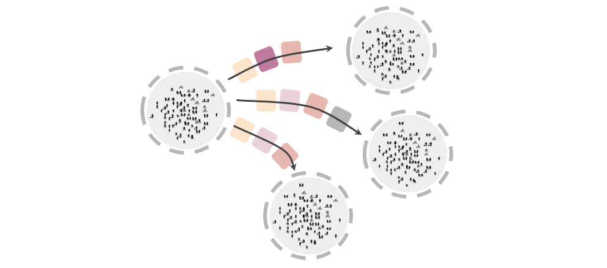
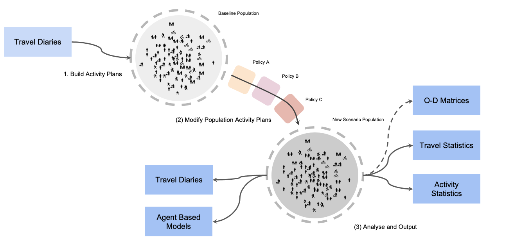

# Pandemic Activity Modeller/Modifier

Peoples day to day activities have been rapidly shifted by recent policies and behavioural 
changes related to the COVID-19 pandemic. If we want to better plan existing and near-term 
scenarios (for transport systems and other sectors) - existing models need to be quickly updated.

  

This project utilises an 
[activity based](https://en.wikipedia.org/wiki/Transportation_forecasting#Activity-based_models)
representation of a population. It makes rules based modifications to individual's travel and 
activities.

This project is not a new activity model. Instead it to seeks to adjust existing activity 
representations, already derived from exiting models or survey data:

(i) **Read/Load** input data (eg travel diary) to household and person Activity Plans

(ii) **Modify** the Activity Plans for new social and government policy scenarios (eg 
remove education activities for non key worker households). Crucially PAM facilitates 
application of detailed policies at the person and household level, while still respecting 
the logic of arbitrarily complex activity chains.

(iii) **Output** to useful formats for activity based models or regular transport models
 
(iv) Facilitate preliminary **Analysis** and **Validation** of changes

This work is primarily intended for transport modellers, to make quick transport demand
scenarios. But it may also be useful for other activity based demand modelling such as for goods 
supply or utility demand.
 
## Contents

- Get Involved
- Installation
- Why Activity Plans?
- Technical Overview
- Project Structure
- Example Activity Plan Modifiers/Policy Mechanisms
- Input/Output Data Formats 
- Technical Notes

## Get Involved

Our goals:

- Theoretical Quality: Expert driven features with research and open case studies.
- Feature Quality: Broadly useful and extendable features with good documentation and some testing.

Less abstractly, there are a good number of **coding** and **non-coding** tasks to chip in 
with:

### Give Early Feedback
Read through this document, let us know what you think, share. Feedback gladly received as an 
[issue](https://github.com/arup-group/pam/issues), on 
[slack](https://join.slack.com/share/I011QU6NN9J/3jAlIBVEbvNln55kGvtZv6ML/zt-dih8pklw-nOPgRzbL3SKj5coH9xemFA)
 or you can email fred.shone@arup.com.
    
### Literature Review
We still need validation of the overall approach. Much of the methodology (detailed in this 
document) is based on what can pragmatically be done, not what theoretically should be done. We'd
 appreciate links to relevant papers. Or even better we'd love a lit review - we'll add it to 
 this document.
 
### Research

We need help with designing useful features, applying them to real problems. As part of this we 
need:

#### Evidence and Data for Validation
We know, for example, that many people have removed certain 
activities from their daily plans, such as to school or university. But we don't know how many. We'd 
like help finding and eventually applying **validation data** such as recent [change in 
mobility](https://www.google.com/covid19/mobility/). 

#### Evidence for New Features

We currently support the following activity plan modifications:

- probabilistic removal of all activities, ie full quarantine or isolation
- probabilistic removal of specific activities, ie education
- automatic extension of other (typically staying at home) activities

But we'd like help to **find evidence** for other modifications that we think are occurring:

- changing duration of an activity
- moving activity closer to home, ie shopping trips
- changing travel choice, ie mode
- moving home location (ie national and local emigration)
- household shared activities/no longer shared activities, such as leisure
- defining key workers

#### Evidence for Technical Methodology
    
Modifying a plan to remove an activity can cascade into other changes. In the case of 
people with complex chains of activities, the removal of a single activity requires adjustments 
to the remainder. Do people leave later of earlier if they have more time for example? The 
methods for this logic is in `pam.core.People`.

### The Code

For a quick start at the code, checkout the 
[getting started notebook/s](https://github.com/arup-group/pam/tree/master/notebooks).

#### Test
If you've come this far - please consider cloning this repo, follow the installation instructions
 run the tests and maybe try out any example notebooks.
 
### Dev
We are maintaining a number of failing tests **#todo** and `NotImplementedErrors` throughout, eg:

- `pam.parse.load_matsim()`: functions required for loading alternative formats to `core.Population`
 objects - such as MATSim format .xml
- `pam.parse.write_travel_plan()`: functions required for writing `core.Population` objects 
back to output formats
- `pam.parse.write_od_matrices()`: function required to convert `core.Population` to OD travel 
matrices
- `pam.activity.Plan.remove_activity()`: we need more methods like this for making sensible plan 
modifications
- `pam.activity.Plan.fill_plan()`: existing methods also need review and better testing

We hold peoples plans as a list; `pam.activity.Plan.day`, but this **data structure** (detailed 
further below) seems clunky. We think maybe we should use a graph representation?

We need help to **go faster**. We expect to deal with populations in the tens of millions. We would 
like help with profiling and implementing parallel compute.

Please branch as you wish but please get in touch first ([issue](https://github.com/arup-group/pam/issues), 
[slack](https://join.slack.com/share/I011QU6NN9J/3jAlIBVEbvNln55kGvtZv6ML/zt-dih8pklw-nOPgRzbL3SKj5coH9xemFA))
.

### Use Cases
We will share open and dummy data where available, we would love people to do some experiments 
and develop some viz and validation pipelines. Any example notebooks can be added to the example
[notebooks](https://github.com/arup-group/pam/tree/master/notebooks).

Help gladly received as an 
[issue](https://github.com/arup-group/pam/issues), on 
[slack](https://join.slack.com/share/I011QU6NN9J/3jAlIBVEbvNln55kGvtZv6ML/zt-dih8pklw-nOPgRzbL3SKj5coH9xemFA)
 or you can email fred.shone@arup.com.
 
## Installation

assuming python ~3.7 and using git:

```
git clone git@github.com:arup-group/pam.git
cd pam
pip install -r requirements.txt
pip install -e .
```

We known that requirements are already available in a up to date Anaconda installation.

## Why Activity Plans?

  

1. They are the ideal mechanism for applying changes, allowing for example, 
consideration of joint dis-aggregate features, such as activity time + activity type + 
previous/next activity + person age + person income + ...

2. They can be post processed for many other output formats and for use in many different 
applications such as transport, utility demand, social impact and so on.

Having said this - there are some technical challenges associated with working with Activity 
Plans. We detail some of these at the end of this doc.

## Technical Overview

The project methodology is as follows:

1. Build Activity Plans from Travel Diary data ([eg](https://github.com/arup-group/pam/tree/master/example_data))
(other formats outstanding)
2. Modify Activity Plans based on combinations of policies, for example:
    1. no activity from persons ill and/or self isolating
    2. reduced education activities
    3. reduced work activities based on occupation and socio-demographics
    4. reduced duration and/or location of shopping activities
    5. identification and removal of discretionary activities
3. Rebuild Travel Diary format from altered activity plans
4. Review changes to population activities (ie check summary statistics)
5. Convert to other formats such as O-D matrices if required

  

## Project Structure

1. The `core` module holds population classes (`Population`, `Household`, `Person`)
2. The `activity` module holds plan classes (`Plan`, `Activity`, `Leg`)
3. The `parse` module is responsible for building activity plans from input data.   
4. The `modify` module is responsible for applying activity modifying policies.

## Example Activity Plan Modifiers/Policy Mechanisms:   

Once we have a representation of activity plans for the population, we can seek to adjust these 
plans based on pandemic based policies. This will use statistical rules dependant on agent 
plans and attributes.

##### Ill and self-quarantined

Reduce overall activities by removing the entirety of an individual's or household's plans, based on 
rates of illness, specifically causing hospitalisation or self-isolation.

Baseline sickness rate is [~2%](https://www.ons.gov.uk/employmentandlabourmarket/peopleinwork/labourproductivity/articles/sicknessabsenceinthelabourmarket/2018).
This will already be reflected in plans. Note that any adjustment to this rate needs to be 
applied with consideration of new WFH rate?

##### Education Activities

Remove education based tours/trips including escorts:

School - critical workers only
University - mostly closed

##### Work Activities

Advice is to work from home where possible - this will effect different occupations differently.

Also likely to remove many discretionary activities that were otherwise included in work based 
tours.

##### Shopping Activities

Guidance is to reduce shopping activities. Additionally existing shopping activities as part of 
another tour (such as work tour)is likely to change to a simple home based tour.

##### Discretionary Activities

Current guidance is to remove discretionary activities, although it is not clear if or how 
exercise can be considered.

## Input/Output Data Formats

We primarily expect to support tabular input the form of a travel diary and person attributes as 
described below.

#### Travel Diary

Tabular data with each row describing a unique trip from an origin (assumed home at start of day)
 to destination. trips are uniquely identified by person ids and ordered by sequence number. 
 Trips are labelled with home, origin, and destination zones, purpose, mode, start time, end 
 time and some form of weighting:
  
**Required fields:**
- `pid` - person ID
- `hid` - household ID
- `seq` - trip sequence number
- `hzone` - household zone
- `ozone` - trip origin zone
- `dzone` - trip destination zone
- `purp` - trip purpose
- `mode` - trip mode
- `tst` - trip start time (minutes)
- `tet` - trip end time (minutes)
- `freq` - weighting for representative population

#### Persons Data

Tabular data describing socio-economic characteristics for each person. For example:

**Recommended fields:**
- `pid` - person ID
- `hsize` - household size
- `car` - number of cars owned by household
- `inc` - income group
- `hstr` - household structure
- `gender` - eg male/female/unknown
- `age` - age group
- `race` - ethnicity
- `license` - eg yes/no/unknown
- `job` - eg full-time/part-time/education/retired/unknown
- `occ` - occupation group


## Technical Notes

##### Intro to Travel Diaries and how they relate to Activity Plans

A key component of this project is the conversion of Travel Diaries to Activity Plans. We define 
a Travel Diary as a sequence of travel legs from zone to zone for a given purpose over a single 
day. The Activity Plan takes these legs and infers the activity types between. Example activity 
types are `home`, `work`, `education`, `excort_education` and so on.

Activity Plan chains can be pretty complex, consider for example a business person attending 
meetings in many different locations and stopping to eat and shop. We always require the plan
 to last 24 hours and start 
and stop with an activity. We like these start and stop activities to both be the same and ideally 
`home`. We think of this as 'looping', but they don't have to. Night shift workers, for example, 
do not start or end the day at `home`.

When we try to infer activity purpose from trip purpose, we expect a return trip to have the 
same purpose as the outbound trip, eg:

*trip1(work) + trip2(work) --> activity1(home) + activity2(work) + activity3(home)*

But this logic is hard to follow for more complex chains, eg:

*trip1(work) + trip2(shop) + trip3(work) --> activity1(home) + activity2(work) + activity3(shop) +
 activity4(home)*

The test cases in `test_3_parse_challenge` capture **some** of the difficult and edge cases observed
 so far.

It is important to note that as a consequence of encoding outbound and return purpose as an 
activity, we never observe a trip purpose as `home`. Luckily we do know the home area from the 
travel diary data (`hzone`). But have to be careful with our logic, as travel between different 
activities locations can be intra-zonal, eg:

*activity1(home, zoneA) + activity2(shop, zoneA) + activity2(shop, zoneA)*

Activity Plans are represented in this project as regular python `lists()`, containing **ordered**
`activity.Activity` and `activity.Leg` objects. Plans must start and end with a 
`activity.Activity`. Two `activity.Actvity` objects must be seperated by a `core.Leg`.

Plans belong to `core.People` which belong to 
`core.Households` which belong to a `core.Population`. For example:

```
from pam.core import Population, Household, Person
from pam.activity import Activity, Leg

population = Population()  # init
household = HouseHold(hid=1)  # hid is household id
person = Person(pid=1)  # pid is person id
person.add(
    Activity(seq=1, act='home', area='a', start_time=0, end_time=450)  # time in minutes
)
person.add(
    Leg(seq=1, mode='car', start_area='a', end_area='b', start_time=450, end_time=480)
)
person.add(
    Activity(2, 'work', 'b', 480, 880)
)
person.add(
    Leg(2, 'car', 'b', 'a', 880, 900)
)
person.add(
    Activity(3, 'home', 'a', 900, 24*60-1)  # last activity must end at 23:59(:59)
)
household.add(person)
population.add(household)
```

##### A Note on the Pain of Wrapping

Activity Plans often enforce that a plan returns to the same activity (type and location) that 
they started at. Furthermore they sometimes enforce that this activity be `home`. Such plans can 
be thought of as wrapping plans. Where the last and first activity can be though of as linked. 
This need not be a `home` activity, for example in the case of night workers.

We have encountered many variations of sequences for plans, including wrapping and wrapping. 
Although they are generally edge cases, they exists and generally represent real people. We are 
therefore endeavoring to support all these cases in our plan modifiers. This is resulting some 
difficult to follow logic (eg `pam.activity.Plan.fill_plan()`).