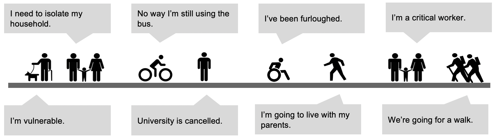

# Population Activity Modeller (PAM)

 
[](https://arup-group.github.io/pam)
[](https://medium.com/arupcitymodelling/pandemic-activity-modifier-intro-3d2dccbc716e)

<!--- the "--8<--" html comments define what part of the README to add to the index page of the documentation -->
<!--- --8<-- [start:docs] -->

PAM is a python API for activity sequence modelling. Primary features:

- common format read/write including MATSim xml
- sequence inference from travel diary data
- rules based sequence modification
- sequence visualisation
- facility sampling
- research extensions

PAM was originally called the "Pandemic Activity Modifier". It was built in response to COVID-19, to better and more quickly update models for behaviour changes from lockdown policies than existing aggregate models.

 

**Who is this for?** PAM is intended for use by any modeller or planner using trip diary data or activity plans.
**What can this do?** PAM provides an API and examples for modifying activity plans, for example, based on COVID-19 lockdown scenarios.

## Features

This project is not a new activity model. Instead it to seeks to adjust existing activity
representations, already derived from exiting models or survey data:


(i) **Read/Load** input data (eg travel diary) to household and person Activity Plans.

(ii) **Modify** the Activity Plans for new social and government policy scenarios (eg
remove education activities for non key worker households). Crucially PAM facilitates
application of detailed policies at the person and household level, while still respecting
the logic of arbitrarily complex activity chains.

(iii) **Output** to useful formats for activity based models or regular transport models. Facilitate preliminary **Analysis** and **Validation** of changes.

This work is primarily intended for transport modellers, to make quick transport demand
scenarios. But it may also be useful for other activity based demand modelling such as for goods
supply or utility demand.

<!--- --8<-- [end:docs] -->
## Installation

The PAM package is not yet indexed on pypi or anaconda, so to install it, we recommend following these steps:

```
git clone git@github.com:arup-group/pam.git
mamba env create -f pam/environment.yml
mamba activate pam
pip install --no-deps -e ./pam
```

For more detailed instructions, see our [documentation](https://arup-group.github.io/pam/0.2/installation/).

## Contributing

There are many ways to make both technical and non-technical contributions to PAM.
Before making contributions to the PAM source code, see our contribution guidelines and follow the instructions below to install and work in a test environment.

If you have followed the recommended installation instructions, all libraries required for development and quality assurance will already be installed. 
If installing directly with pip, you can install these libraries using the `tests` option, i.e., `pip install -e ./pam[tests]`

If you plan to make changes to the code then please make regular use of the following tools to verify the codebase
while you work:

- `scripts/code-qa/qa-checks.sh` - run a sensible combination of all the following
- `pytest` - run the unit test suite
- `scripts/code-qa/code-coverage.sh` - run unit tests and verify the code coverage threshold
- `scripts/code-qa/notebooks-smoke-test.sh` - smoke test all Jupyter notebooks found in the `examples` directory
- `scripts/code-qa/check-staged-file-sizes.sh` - check for large file sizes that have been git staged
- `scripts/code-qa/check-all-file-sizes.sh` - check for large file sizes

For more information, see our [documentation](https://arup-group.github.io/pam/0.2/get_involved).

## Building the documentation

If you are unable to access the online documentation, you can build the documentation locally.
First, [install PAM](#installation), then deploy the documentation using [mike](https://github.com/jimporter/mike):

```
mike deploy 0.2
mike serve
```

Then you can view the documentation in a browser at http://localhost:8000/.